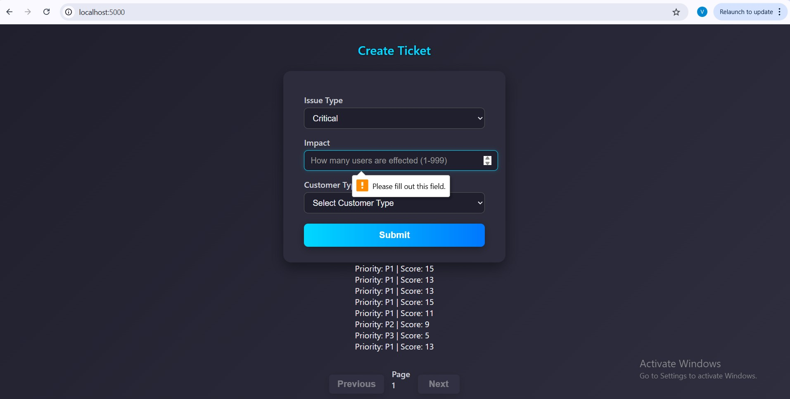
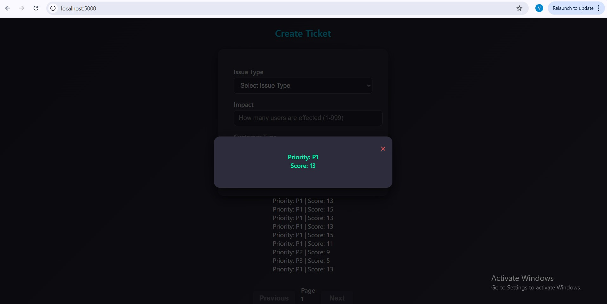

### Customer Support Ticket Priority System

## Ticket Priority System

A small Flask-based service that assigns priority scores and labels to customer support tickets based on issue severity, customer type, impact and elapsed time. Built a full-stack project as backend design, API development, a priority engine, MySQL integration and simple frontend.

---

## Project Overview
This project accepts ticket details via a REST API(POST,GET), computes a priority score using business rules, persists tickets to MySQL, and returns the computed priority immediately. It includes a minimal static frontend and a repository layer for database access.

## Problem Statement
Support teams often queue requests in arrival order. Critical or high-value customers may wait unnecessarily. This system automates prioritization so the most urgent and valuable issues surface to the support team faster and consistently.

## Solution Architecture
- **Frontend**: static HTML/CSS/JS served by Flask for quick manual testing.
- **API**: Flask providing JWT-authentication, ticket creation, and listing endpoints.
- **Priority Engine**: isolated module that computes priority score and label.
- **Persistence**: MySQL with a repository layer and connection pooling.
- **Deployment**: Dockerfile + docker-compose for containerized runs.
- **Host**: Use railway.app for easy access.

## Features
- User registration and login (JWT)
- Ticket creation with priority calculation
- Ticket listing with pagination
- Simple static frontend for manual testing
- Database initialization script
- Basic logging and input validation

## Tech Stack
- Python 3.11
- Flask, Flask-JWT-Extended, Flask-CORS
- bcrypt for password hashing
- MySQL (local or managed)
- mysql-connector-python
- Gunicorn for production deployment
- Docker
- simple HTML/CSS/JS for frontend
- railway.app for hosting

## System Design
- Stateless API with JWT authentication
- PriorityEngine separated from persistence to keep business logic testable
- Repository layer uses parameterized queries to avoid injection
- Connection pooling to optimize DB connections

## Data Flow
1. Client requests /auth/register or /auth/login.
2. Backend authenticates and returns JWT.
3. Client posts a ticket to /tickets with JWT in Authorization header.
4. Server validates JWT, constructs Ticket, PriorityEngine computes score and level.
5. Repository persists ticket and returns computed result.
6. Client displays result and can list tickets.

## Priority Classification Logic
# Priority is computed from weighted factors:
- Issue type (example weights): critical (5), major (3), minor (1)
- Customer type: enterprise (5), paid (3), free (1)
- Impact: numeric or mapped buckets (e.g., small=1, medium=3, large=5)
- Time elapsed since creation (to age tickets up)

# Scores map to discrete labels:
- P0: score >= 16
- P1: 11 ≤ score < 16
- P2: 6 ≤ score < 11
- P3: score < 6

**(Weights are configurable in the PriorityEngine module.)**

## Installation (Local)
1. Clone the repository:
   git clone <repo-url>
2. Create and activate a virtual environment:
   python -m venv .venv
   .venv\Scripts\activate  (Windows) or source .venv/bin/activate (macOS/Linux)
3. Install dependencies:
   pip install -r backend/core/requirement.txt

## Configuration
- Create a `.env` file in `backend/core/` with:
- JWT_SECRET_KEY=replace-with-secret
- DB_HOST=localhost
- DB_USER=root
- DB_PASSWORD=your_mysql_password
- DB_NAME=ticket_priority_system
- DB_PORT=3306
*(Adjust values as needed.)*

## Usage
1. Initialize the database:
   mysql -u root -p < backend/core/repository/SETUP.sql
2. Run the app from project root:
   python -m backend.core.app
3. Open the UI:
   http://localhost:5000

## API Endpoints
- POST /auth/register
  - body: { "username": "...", "password": "..." }
- POST /auth/login
  - body: { "username": "...", "password": "..." }
  - returns: { "access_identity": "<JWT>" }
- POST /tickets (protected)
  - headers: Authorization: Bearer <JWT>
  - body: { "issue_type": "critical|major|minor", "impact": int, "customer_type": "enterprise|paid|free" }
  - returns: { "score": int, "level": "P0|P1|P2|P3" }
- GET /tickets?page=1&limit=10
  - returns paginated tickets

## Database Schema
**users**
- id INT PRIMARY KEY AUTO_INCREMENT
- username VARCHAR UNIQUE
- password_hash VARCHAR
- created_at TIMESTAMP

**tickets**
- id INT PRIMARY KEY AUTO_INCREMENT
- issue_type VARCHAR
- impact INT
- customer_type VARCHAR
- priority_score INT
- priority_level VARCHAR
- created_at TIMESTAMP

Initialization script: `backend/core/repository/SETUP.sql`.

## Model / Algorithm Explanation
PriorityEngine computes a weighted sum of the factors list. The output score is converted into a discrete priority label. The model is intentionally simple so it is transparent and easy to tune.

## Error Handling
- 400 for malformed requests or missing fields
- 401 for authentication failures
- 403 for forbidden actions (future expansion)
- 500 for unexpected server errors
**Server logs provide context and responses avoid leaking secrets.**

## Testing
- **Manual**: use the included frontend and Postman/Thunder Client.
- **Recommended unit tests**: PriorityEngine logic, repository methods (mock DB), and auth flows.
- Add CI (GitHub Actions) to run tests and linting.

## Performance Considerations
- Use connection pooling (implemented) and proper DB indexing (created_at, priority_level).
- For higher load: scale the API horizontally behind a load balancer, use caching layers (Redis) and async workers for heavy background tasks.

## Security Considerations
- Passwords hashed with bcrypt.
- JWT secret kept in environment variables.
- Use HTTPS in production.
- Parameterized queries to avoid SQL injection.
- Limit JWT lifetime and consider refresh tokens and token revocation.

## Deployment
- Dockerfile and docker-compose are provided for local container testing.
- **For Railway**:
  - Push to GitHub, connect the repo to Railway, configure env vars and managed MySQL.
  - Railway can build from the Dockerfile or use a buildpack.
- Example:
  cd docker
  docker-compose up --build

## Future Enhancements
- Role-based access and admin UI
- SLA tracking and automatic ticket assignment
- Historical analytics and ML-based priority prediction
- Complete unit and integration tests with CI
- Rate limiting and monitoring (Prometheus/Grafana)
- Token refresh and revocation

## Screenshots

## Author
Vineel Kumar Polavarapu

If you have any queriesy you can find me on:
- Linkedin : www.linkedin.com/in/vineelkumarpolavarapu
